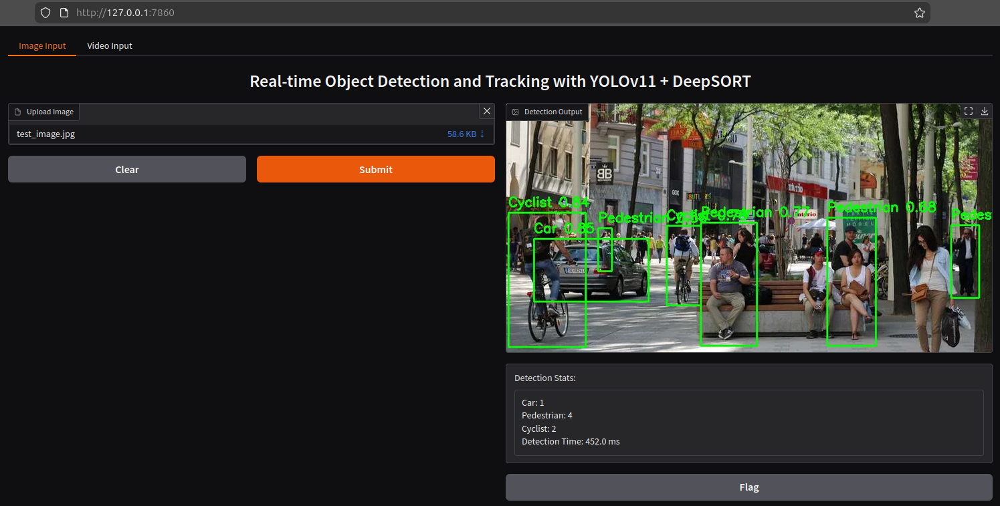

# Real-time Object Detection and Tracking: YOLOv11 TensorRT model and DeepSORT
The objective of this project is to develop a real-time object detection and tracking model for self-driving cars and autonomous robots.

### KITTI Dataset:
[KITTI dataset](https://www.cvlibs.net/datasets/kitti/eval_tracking.php) is a popular benchmark dataset for Computer Vision and Machine Learning applications. In total the dataset contain 14,999 images with 7,481 train and 7,518 test images. The training set is annotated with ground-truth labels. 
The annotated labels have a specific format: `<type> <truncated> <occluded> <alpha> <bbox_left> <bbox_top> <bbox_right> <bbox_bottom> <height> <width> <length> <x> <y> <z> <rotation_y> <score>`. 
There are 9 label categories: `Car, Van, Truck, Pedestrian, Person_sitting, Cyclist, Tram, Misc, DontCare`. But I focus on the 3 main classes: `Car, Pedestrian, Cyclist`.

### Solution:
I use [YOLOv11 model](https://docs.ultralytics.com/models/yolo11/) for object detection and DeepSORT for object tracking.
1. <ins>Dataset Preparation</ins>: Convert KITTI labels to YOLO label format. YOLO label format: `<class_id> <x_center> <y_center> <width> <height>`. KITTI training images are then split into training and validation sets.
2. <ins>Model Training</ins>: Load pre-trained YOLO model and train on training set.
3. <ins>Optimization</ins>: Export trained model to TensorRT for real-time inferencing.
4. <ins>Evaluate</ins>: Get ground truth from KITTI labels. Get detections from YOLOv11 model. Get tracks from DeepSORT. Compute IoU motmetrics - MOTA, MOTP, IDF1.
5. <ins>Image Pipeline</ins>: Accepts an uploaded image, runs YOLOv11 detection, draws bounding boxes with class labels and confidences. Aggregates and displays per-class object counts. Reports detection time for user awareness of inference speed.
6. <ins>Video Pipeline</ins>: Accepts a video file, reads and processes it frame-by-frame. For each frame: Runs YOLOv11 detection and DeepSORT tracking, draws bounding boxes and track IDs. Overlays real-time stats: FPS and number of active tracks. Frames are batched into small chunks, written to temporary .mp4 files, and yielded in a generator for live playback on a UI.
7. <ins>Gradio UI</ins>: An interactive GUI panel to upload images or videos for multi-object detection and tracking.

 

### Files:
* _prepare_dataset_:                 KITTI to YOLO format conversion. Split images into train and val sets.
* _train_model_:                     Train yolo model.
* _evaluate_:                        Evaluate multi-object tracking.
* _helper_:                          Helper functions.
* _main_:                            User Interface.
* _deepSORT_tracking_:               Standalone DeepSORT tracking.
* _object_detection_tracking_.py:    Object detection and tracking.
* _.gitignore_:                      Git ignore.
* _.env_:                            Env file.
* _.env_sample_:                    Sample env file.

### Folders:
* _data_object_image_2_:        Raw KITTI training and testing images.
* _data_object_label_2_:        KITTI labels for training images. Test images unlabelled.
* _data_tracking_image_2_:      Raw KITTI training and testing images for tracking.
* _data_tracking_label_2_:      KITTI labels for training images for tracking.
* _yolo/labels_:                Converted labels from KITTI to yolo format.
* _dataset/images_:             Splitted training images from 'data_object_image_2' into train and val sets.
* _dataset/val_:                Labels in yolo format for train and val set in 'dataset/images'.
* _dataset/dataset.yaml_:       Details of the dataset. Give to model for training.
* _run/detect/train/weights_:   Trained model weights.

### Instructions to run code:
* `$ python main.py`
* Click `Running local URL: http:\\127.0.0.1:7689` to launch UI.
* Upload images/videos to test.
